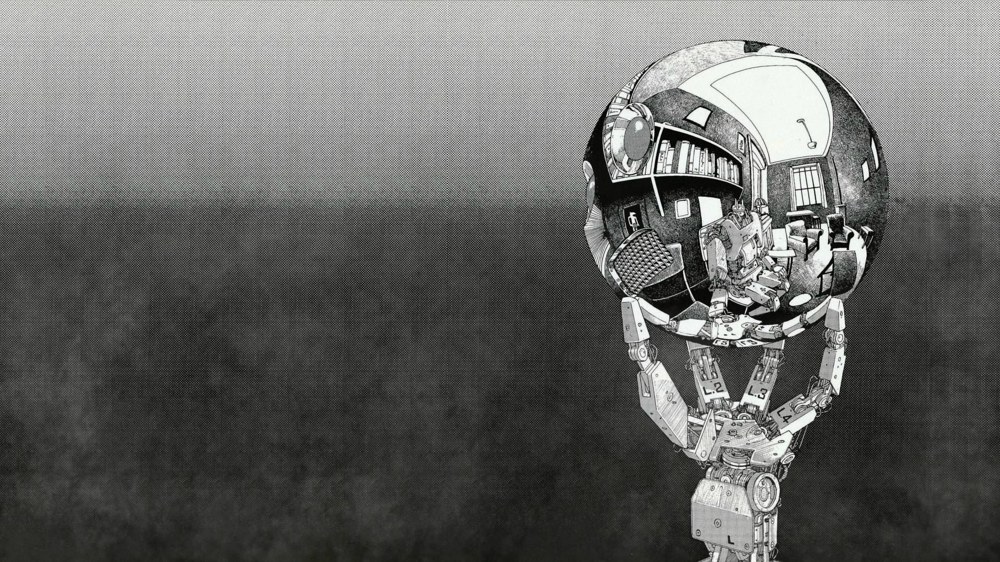

<!-- **Stay hungry, Stay foolish.** -->

> 我们都是孤独的刺猬，只有频率相同的人才能看见彼此内心深处不为人知的优雅.

<!-- > 你背不下来的书，总有人能背下来，你做不出来的题，总有人能做出来，你愿意拖到明天的事，总有人今天努力做完，那么不好意思，你想去的学校也只能别人去了，你想过的人生也只能别人过了.

> 如果你发现,就算自己不努力,不上进,不费劲,也能轻松的呆在原地,那么你就该审视一下你所在的环境: "它到底是因为领先了行业很多,所以有资格停下来歇一歇? 还是因为它可以拒绝竞争,所有有资格闲庭信步? 又或者是因为它已经烂了跟,所以死气沉沉? " 如果你发现,你整日与一堆破事纠缠,常年裹挟在"心不甘情不愿"的情绪下,一直与"没有上进心"的人打交道,那么你就得问一下自己: "你到底是贪图这里的零压力,还是因为没有挣脱的本事? 愿事与愿违时,你不会整日愤愤不平;愿得偿所愿时,你不必终日惶惶不安" -->

  

> 关注**前端趋势**  
> 了解**后端发展**

<!-- 

<a
  target="_blank"
  href="http://beian.miit.gov.cn"
  style="color:#999;cursor:pointer;font-weight:normal;"
  >豫ICP备19043979</a>

 -->

<!--

  <a
    target="_blank"
    href="http://beian.miit.gov.cn"
    style="color:#999;cursor:pointer;font-weight:normal;"
  >豫ICP备19043979</a>

 -->
