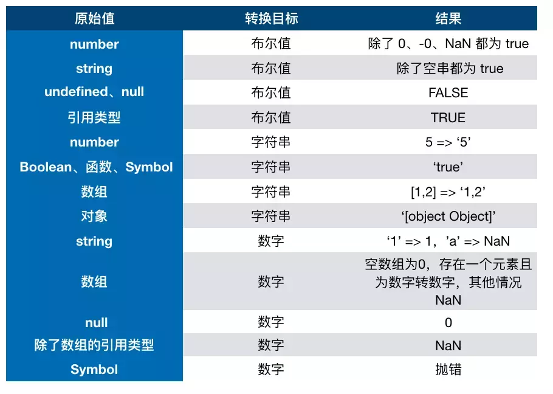

# 基础回顾
## 数据类型

最新的 ECMAScript 标准定义了 8 种数据类型:

    7种原始类型:
        Boolean
        Null
        Undefined
        Number
        BigInt
        String
        Symbol 
    
    Object(引用类型):
        Object
        Array
        RegExp
        Date
        Math
        Function

> 在计算机科学中, 对象是指内存中的可以被标识符引用的一块区域.


## 数据类型的判断

```js
// 原始类型
let bol = true;
// typeof bol = "boolean"
let nul = null;
// typeof nul = "object"
let undefine;
// typeof undefine = "undefined"
let number = 1024;
// typeof number = "number"
let bigInt = 3141592653589793238462643383279n;
// typeof bigInt = "bigint"
let str = "string";
// typeof str = "string";
let symbol = Symbol('symbol');
// typeof symbol = "symbol"

// 引用类型
// RegExp Date Math Function Set WeakSet Map WeakMap 都是Javascript(内置的)函数
let obj = {}; 
// typeof obj = "object"
// obj instanceof Object = true
let arr = [];
// typeof arr = "object"
// arr instanceof Array = true
let reg = /[a-zA-z0-0_]/;
// reg instanceof RegExp = true
let func = function(){};
// func instanceof Function = true
```
::: warning 注意
typeof null = "object" 是Javascript历史悠久的一个bug~
:::
::: tip 总结:
使用 **typeof** 检查除null以外的原始类型,使用 **instanceof** 检查引用类型.
:::

## 数据之间的转换
Javascript中的类型转换包含三种  
1.转成数字  
2.转成布尔值  
3.转成字符串  


<div align="center" >
  
</div>

>  图片来源 **[神三元](https://juejin.im/post/5dac5d82e51d45249850cd20)**


## 数组 Array

### from
```js
// Array.from() 方法从一个类似数组或可迭代对象创建一个新的，浅拷贝的数组实例。
let obj = {num:3};
let arr = [1,2,3];
let arr2 = Array.from(arr,x=>x*x);
let arr3 = Array.from(arr,function(x){
  return x*this.num;
},obj);

```

### isArray
```js
// Array.isArray() 用于确定传递的值是否是一个 Array
Array.isArray(true);
// false
Array.isArray(2);
// false
Array.isArray('string');
// false
Array.isArray([1,2,3]);
// true
Array.isArray({x:'num'});
// false
```

### of
```js
// Array.of() 方法创建一个具有可变数量参数的新数组实例，而不考虑参数的数量或类型。
Array.of(3);
// [3]

Array(3);
// [ , , ,];
```

### concat
```js
//  concat() 方法用于合并两个或多个数组。此方法不会更改现有数组，而是返回一个新数组。
let arr1 = [1,2,3];
let arr2 = [4,5,6];
let arr3 = [].concat(arr1,arr2);
//[1,2,3,4,5,6];
```

### copyWithin
```js
// copyWithin() 方法浅复制数组的一部分到同一数组中的另一个位置，并返回它，不会改变原数组的长度。
let num = [1, 2, 3, 4, 5];

num.copyWithin(-2);
// [1, 2, 3, 1, 2]

num.copyWithin(0, 3);
// [4, 5, 3, 4, 5]

num.copyWithin(0, 3, 4);
// [4, 2, 3, 4, 5]

num.copyWithin(-2, -3, -1);
// [1, 2, 3, 3, 4]
```

### entries
```js
// entries() 方法返回一个新的Array Iterator对象，该对象包含数组中每个索引的键/值对。
var arr = ["a", "b", "c"];
var iterator = arr.entries();
for (let i of iterator) {
  console.log(i);
}
```

### every
```js
//every() 方法测试一个数组内的所有元素是否都能通过某个指定函数的测试。它返回一个布尔值。
let arr = [1,2,3,4,5,6,7];
arr.every(x=>(x<10));
// true
```
### some
```js
// some() 方法测试数组中是不是至少有1个元素通过了被提供的函数测试。它返回的是一个Boolean类型的值。
let arr = [1,2,3,4,5,6,7];
arr.some(x=>(x>=7));
// true
```

### fill
```js
// fill() 方法用一个固定值填充一个数组中从起始索引到终止索引内的全部元素。不包括终止索引。
[1,2,3,4].fill(1);
// [1,1,1,1]
[1,2,3,4].fill(1,2);
// [1,2,1,1]
[1,2,3,4].fill(1,2,3);
// [1,2,1,4]
```

### filter
```js
// filter() 方法创建一个新数组, 其包含通过所提供函数实现的测试的所有元素。 
let arr = [1,true,undefined,null,{},[]];
arr.filter(item=>!!item);
// [1,true,{},[]];
```

### find
```js
// find() 方法返回数组中满足提供的测试函数的第一个元素的值
let arr = [
  {num:1},
  {num:2},
  {num:3}
];
arr.find((item)=>(item.num>=2));
// {num:2}
```

### findIndex
```js
// findIndex()方法返回数组中满足提供的测试函数的第一个元素的索引。否则返回-1。
let arr = [1,true,undefined,null,{},[]];
arr.findIndex(item=>item===null);
// 3
```
### flat
```js
// flat() 方法会按照一个可指定的深度递归遍历数组，并将所有元素与遍历到的子数组中的元素合并为一个新数组返回。
let arr = [1,2,[3,4,5]];
let arr1 = ['a','b',[['c',['d','e']]]];
arr.flat();
// [1,2,3,4,5];
arr1.flat();
// ['a','b',['c',['d','e']]];
arr1.flat(2);
// ['a','b','c',['d','e']]
arr1.flat(3);
// ['a','b','c','d','e']
arr1.flat(Infinity);
// ['a','b','c','d','e']
```

### flatMap
```js
// flatMap() 方法首先使用映射函数映射每个元素，然后将结果压缩成一个新数组。
// 相当于执行map方法后再执行一次flat
let arr = [1, 2, 3, 4];
arr.map(x => [x * 2]); 
// [[2], [4], [6], [8]]
arr.flatMap(x => [x * 2]);
// [2, 4, 6, 8]
// 只会将 flatMap 中的函数返回的数组 “压平” 一层
arr1.flatMap(x => [[x * 2]]);
// [[2], [4], [6], [8]]
```

### forEach
```js
// forEach() 方法对数组的每个元素执行一次提供的函数
// 没有办法中止或者跳出 forEach() 循环，除了抛出一个异常
let arr = ['a','b','c'];
arr.forEach(item=>console.log(item));

```

### includes
```js
// includes() 方法用来判断一个数组是否包含一个指定的值
let arr = ["Cat","Dog","Bat"];
arr.includes("Cat");
// true
arr.includes('cat');
// false
```

### indexOf
```js
// indexOf()方法返回在数组中可以找到一个给定元素的第一个索引，如果不存在，则返回-1。
let arr = ['ant', 'bison', 'camel', 'duck'];
arr.indexOf('bison');
// 1
arr.indexOf('bison', 2);
// -1
```
### lastIndexOf
```js
// lastIndexOf() 方法返回指定元素（也即有效的 JavaScript 值或变量）在数组中的最后一个的索引，如果不存在则返回 -1。从数组的后面向前查找，从 fromIndex 处开始。
let arr = ['ant', 'bison', 'camel', 'duck'];
arr.lastIndexOf('bison');
// 1
arr.lastIndexOf('bison', 2);
// 1
```

### join
```js
// join() 方法将一个数组（或一个类数组对象）的所有元素连接成一个字符串并返回这个字符串
let arr = ["Cat","Dog","Bat"];
arr.join();
arr.join(",");
arr.join("");
arr.join("_");
```

### keys
```js
//  keys() 方法返回一个包含数组中每个索引键的Array Iterator对象。
let arr = ['a', 'b', 'c'];
for (let key of arr.keys()) {
  console.log(key);
}
// 0
// 1
// 2
[...arr.keys()];
// [0,1,2]
```

### values
```js
// values() 方法返回一个新的 Array Iterator 对象，该对象包含数组每个索引的值
let arr = ['a', 'b', 'c'];
for (let value of arr.values()) {
  console.log(value); 
}
// a
// b
// c
[...arr.values()];
// ["a","b","c"]
```


### map
```js
// map() 方法创建一个新数组，其结果是该数组中的每个元素都调用一个提供的函数后返回的结果。
let arr = [1,2,3,4];
let result = arr.map(item=>Math.pow(item,2));
// [1,4,9,16]
```

### pop
```js
// pop()方法从数组中删除最后一个元素，并返回该元素的值。此方法更改数组的长度。
// 返回删除元素的下标
let arr = [1,2,3,4];
arr.pop();
// 3
// arr [1,2,3]
```

### push
```js
// push() 方法将一个或多个元素添加到数组的末尾，并返回该数组的新长度。
let arr = [1,2,3,4];
arr.push(5,6,7,8);
// 8
// arr [1,2,3,4,5,6,7,8];
```
### shift
```js
// shift() 方法从数组中删除第一个元素，并返回该元素的值。此方法更改数组的长度。
// 返回删除元素的下标
let arr = [1,2,3,4];
arr.shift();
// 0
// arr [2,3,4]
```
### unshift
```js
// unshift() 方法将一个或多个元素添加到数组的开头，并返回该数组的新长度(该方法修改原有数组)。
let arr = [1,2,3,4];
arr.unshift(5,6,7,8);
// 8
// arr [5,6,7,8,1,2,3,4];
```

### reduce
```js
// reduce() 方法对数组中的每个元素执行一个由您提供的reducer函数(升序执行)，将其结果汇总为单个返回值。
let arr = [5,6,7,8];
let result = arr.reduce((result,value,index)=>{
  result[index]=value;
  return result;
},{});
// {0: 5, 1: 6, 2: 7, 3: 8}
```

### reduceRight
```js
let arr = [5,6,7,8];
let result = arr.reduceRight((result,value,index)=>{
  result.push(value);
  return result;
},[]);
// [8,7,6,5]
```

### reverse
```js
// reverse() 方法将数组中元素的位置颠倒，并返回该数组。返回更改后的数组
let arr = [1,2,3,4];
arr.reverse();
// [4,3,2,1]
```

### slice
```js
// slice() 方法返回一个新的数组对象，这一对象是一个由 begin 和 end 决定的原数组的浅拷贝（包括 begin，不包括end）
let arr = [1,2,3,4];
arr.slice();
// [1,2,3,4]
arr.slice(0,2);
// [1,2]
```

### sort
```js
// sort() 方法用原地算法对数组的元素进行排序，并返回数组。默认排序顺序是在将元素转换为字符串，然后比较它们的UTF-16代码单元值序列时构建的
let arr = [
  { name: 'Edward', value: 0 },
  { name: 'The', value: 3 },
  { name: 'Magnetic',value:5 },
  { name: 'Sharpe', value: 1 },
  { name: 'Zeros', value: 4 }
  { name: 'And', value: 2 },
];
// 根据name排序
arr.sort((a,b)=>(a.name===b.name?0:a.name>b.name?1:-1));
// [
//   { name: 'And', value: 2 },
//   { name: 'Edward', value: 0 },
//   { name: 'Magnetic' },
//   { name: 'The', value: 3 },
//   { name: 'Sharpe', value: 1 },
//   { name: 'Zeros', value: 4 }
// ]

// 根据value排序
arr.sort((a,b)=>(a.value===b.value?0:a.value>b.value?1:-1));
// [
//   { name: 'Edward', value: 0 },
//   { name: 'Sharpe', value: 1 },
//   { name: 'And', value: 2 },
//   { name: 'The', value: 3 },
//   { name: 'Zeros', value: 4 }
//   { name: 'Magnetic',value:5 },
// ]
```

### splice
```js
// splice() 方法通过删除或替换现有元素或者原地添加新的元素来修改数组,并以数组形式返回被修改的内容。此方法会改变原数组。
// 语法:array.splice(startIndex[, deleteCount[, addItem1[, addItem2[, ...]]]])
let arr = ['Jan', 'Feb', 'March', 'April', 'June'];
arr.splice(2);
// ['March', 'April', 'June']
// arr ['Jan', 'Feb']

arr.splice(2,1);
// ['March']
// arr ['Jan', 'Feb','April', 'June'];

arr.splice(2,0,"Vyron");
// []
// arr ['Jan', 'Feb',"Vyron", 'March', 'April', 'June'];

arr.splice(3,1,"VFiee");
// ['April']
// arr ['Jan', 'Feb', 'March', 'VFiee', 'June']

arr.splice(1,1,"Alipay");
// ['Feb']
// arr ['Jan', 'Alipay', 'March', 'April', 'June']
```


## 对象 Object
```js
/*
  构造函数,原型和实例的关系
  !!!!! 1.每个构造函数(constructor)都有一个原型对象(prototype),原型对象都包含一个指向构造函数的指针
        2.构造函数实例(instance)都包含一个指向原型对象的内部指针__proto__
        3.每个构造函数都有一个指向构造该构造函数(构造函数的构造函数)原型对象的内部指针__proto__
  constructor  指向构造函数
  __proto__    指向构造函数的原型对象(每个构造函数实例所有的属性,指向构造函数constructor的prototype属性)
  prototype    构造函数constructor的属性prototype
*/

```
### assign
```js
// Object.assign() 方法用于将所有可枚举属性的值从一个或多个源对象复制到目标对象

// 复制对象
let obj ={x:1,y:2};
let copyObj = Object.assign({},obj);
// {x:1,y:2};

// 合并对象
let obj2 = {y:3,z:4};
let combineObj = Object.assign({},obj,obj2);
// {x: 1, y: 3, z: 4}
```

### create
```js
// Object.create()方法创建一个新对象，使用现有的对象来提供新创建的对象的__proto__
let person = {
  sayName:function(){
    console.log(`My name is ${this.name}`);
  }
};

let LiMing = Object.create(person);
let XiaoHua = {};
console.log(LiMing.__proto__)
console.log(XiaoHua.__proto__);
```
### keys values  entries
```js
// Object.keys() 方法会返回一个由一个给定对象的自身可枚举属性组成的数组
// Object.values()方法返回一个给定对象自身的所有可枚举属性值的数组
// Object.entries()方法返回一个给定对象自身可枚举属性的键值对数组
let obj = {x:1,y:2,z:3};
let keys = Object.keys(obj);
// ["x", "y", "z"]
let values = Object.values(obj);
// [1, 2, 3]
let kvs = Object.entries(obj);
// [["x":1],["y":2],["z",3]]
```

### freeze
```js
// Object.freeze() 冻结一个对象的属性和原型.
// 一个对象是冻结的是指它不可扩展，所有属性都是不可配置的，且所有数据属性（即没有getter或setter组件的访问器的属性）都是不可写的。
let obj = {x:1};
let frozenObj = Object.freeze(obj);
obj.x=2;
```

### isFrozen
```js
// Object.isFrozen()方法判断一个对象是否被冻结。
let obj = {};
let frozenObj = Object.freeze(obj);
let isF = Object.isFrozen(obj);

```

### is


### isExtensible


### isSealed


### preventExtensions


### seal


### setPrototypeOf


### Object.hasOwnProperty


### Object.isPrototypeOf

### Object.toString


### Object.toLocalString


### Object.valueOf